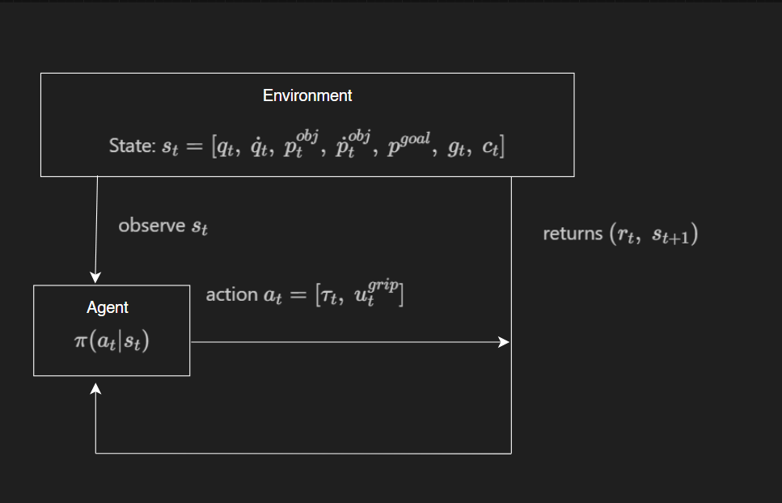
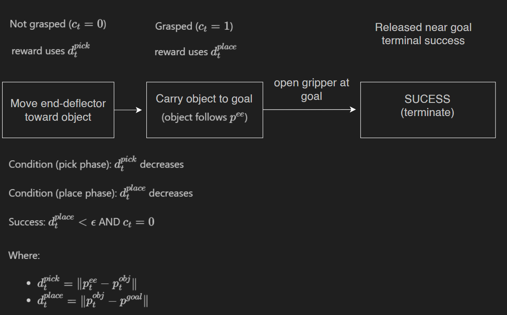

# Pick-and-place as an MDP (fast and smooth motor control)

## Objective
Learn a policy that controls a robot arm to **pick** an object and **place** it at a target location, while producing motions that are:

- **Fast**: completes the task in fewer time steps.
- **Smooth**: avoids jerky motion and excessive actuation.

The agent has feedback about **joint/link positions and velocities** and issues **motor-level commands**.

---

## 1) MDP definition

We define an MDP as a tuple $(S, A, P, R, \gamma)$.

---

## 2) State space $S$

A practical Markov state must include variables needed to predict the next state under motor commands (dynamics) and variables needed to assess task completion (object, goal, and grasp status).

**State vector (conceptual):**
- $s_t = [q_t,\ \dot q_t,\ p^{obj}_t,\ \dot p^{obj}_t,\ p^{goal},\ g_t,\ c_t]$

**Components:**
- $(q_t \in \mathbb{R}^n)$: joint positions (angles).
- $(\dot q_t \in \mathbb{R}^n)$: joint velocities.
- $(p^{obj}_t \in \mathbb{R}^3)$: object position (or pose if needed).
- $(\dot p^{obj}_t \in \mathbb{R}^3)$: object velocity (helps with slip/disturbances).
- $(p^{goal} \in \mathbb{R}^3)$: target placement position (fixed per episode or randomized at reset).
- $(g_t)$: gripper opening (continuous aperture) or gripper state (open/closed).
- $(c_t \in \{0,1\})$: grasp/contact flag (1 if object is held, 0 otherwise).

**Practical note:** End-effector pose and velocity can be derived from $(q_t, \dot q_t)$. They may be included explicitly for convenience, but the definition above is already Markov.

---

## 3) Action space $A$

Because the agent “controls the motors directly,” the simplest faithful action is **joint torques** plus a gripper command:

- $a_t = [\tau_t,\ u^{grip}_t]$

**Components:**
- $(\tau_t \in \mathbb{R}^n)$: joint torques, bounded by actuator limits.
- $(u^{grip}_t)$: gripper command (open/close or continuous command).

---

## 4) Transition dynamics $P(s_{t+1} \mid s_t, a_t)$

The transition model captures:
- rigid-body dynamics of the arm under torques,
- contact dynamics between the gripper and object (friction, collisions),
- grasp logic: if the gripper closes near the object, the object becomes attached (held); otherwise it remains free.

Formally:
- $s_{t+1} \sim P(\cdot \mid s_t, a_t)$

In simulation, $P$ may be approximately deterministic. In real systems, it is effectively stochastic due to sensor noise and contact uncertainty.

---

## 5) Reward function $R(s_t, a_t, s_{t+1})$

We want a reward that:
1. anchors the goal to successful pick-and-place,
2. encourages speed,
3. encourages smoothness and discourages excessive actuation,
4. avoids obvious reward hacking.

### 5.1 Task distances

Define:
- Pick distance (end-effector to object): $d^{pick}_t = \lVert p^{ee}_t - p^{obj}_t \rVert$
- Place distance (object to goal): $d^{place}_t = \lVert p^{obj}_t - p^{goal} \rVert$

### 5.2 Phase-dependent progress shaping

Use the grasp flag $(c_t)$ to switch which distance matters:

- $r^{prog}_t = (1-c_t)\,\alpha\,(d^{pick}_{t-1}-d^{pick}_t) + c_t\,\beta\,(d^{place}_{t-1}-d^{place}_t)$

This rewards consistent progress rather than simply being close.

### 5.3 Sparse event bonuses

- Grasp bonus: $r^{grasp}_t = R_g \cdot \mathbb{1}[\text{grasp occurs at }t]$
- Success bonus (placed and released): $r^{succ}_t = R_s \cdot \mathbb{1}[\lVert p^{obj}_t - p^{goal}\rVert < \epsilon\ \text{and}\ c_t = 0]$

Requiring release near the goal prevents a failure mode where the agent holds the object at the goal indefinitely.

### 5.4 Smoothness and speed penalties

- Effort penalty: $r^{eff}_t = -\lambda_\tau \lVert \tau_t \rVert^2$
- Smoothness penalty: $r^{smooth}_t = -\lambda_{\Delta a}\lVert a_t - a_{t-1} \rVert^2$
- Time penalty: $r^{time}_t = -c$

### 5.5 Full reward

- $r_t = r^{prog}_t + r^{grasp}_t + r^{succ}_t + r^{eff}_t + r^{smooth}_t + r^{time}_t$

---

## 6) Episode termination

- **Success**: object is placed near the goal and released:
  - $(\lVert p^{obj}_t - p^{goal}\rVert < \epsilon)$ and $(c_t = 0)$

- **Timeout**: episode ends after $(T)$ steps.

Optional safety terminations:
- joint limits exceeded,
- collisions,
- object leaves workspace.

---

## 7) Diagram (MDP and phase structure)

### 7.1 Agent-environment interaction

### 7.2 Phase structure (via grasp flag $c_t$)

