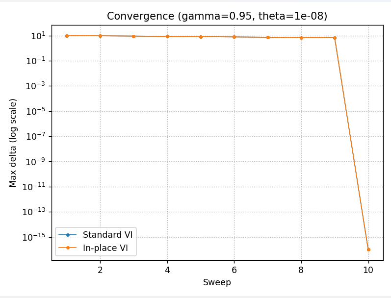

# 5x5 Gridworld (Problem 3) – Value Iteration Report

## Problem setup (MDP)

### State space
- States are grid cells indexed by row and column: $(s_{r,c})$ where $(r,c) \in \{0,1,2,3,4\}^2$.

### Terminal (goal) state
- Goal state: $(s_{4,4})$.
- Episode ends when the agent reaches the goal.
- The goal is absorbing: once at $(s_{4,4})$, the agent remains there and no further movement occurs.
- Implementation uses $(V(s_{4,4})=R(s_{4,4}))$.

### Grey (non-favourable) states
- $S_{grey} = \{s_{2,2},\ s_{3,0},\ s_{0,4}\}$.

### Action space
- $(A = \{\text{right},\ \text{down},\ \text{left},\ \text{up}\})$.

### Transition dynamics
- Deterministic transitions:
  - If an action moves the agent inside the grid, the transition is to that neighbor.
  - If an action would go out of bounds, the next state is unchanged: $(s' = s)$.
  - If the agent is already at the goal $(s_{4,4})$, it stays there (absorbing terminal).

### Reward function (state-based)
- $(R(s)=+10)$ if $(s=s_{4,4})$ (goal)
- $(R(s)=-5)$ if $(s \in S_{grey})$ (grey states)
- $(R(s)=-1)$ otherwise (regular states)

### Discount factor
- $(\gamma = 0.95)$.

---

## Algorithms implemented

### 1) Standard (synchronous) Value Iteration
For non-terminal states:
- $(V_{k+1}(s) = R(s) + \gamma \max_{a \in A} V_k(s'))$

For the terminal state:
- $(V_{k+1}(s_{4,4}) = R(s_{4,4})=10)$

Standard VI computes $(V_{k+1})$ from a snapshot of $(V_k)$ using a separate array each sweep.

### 2) In-place Value Iteration (Gauss-Seidel style)
Same Bellman update, but values are updated directly in one array so later updates in the same sweep reuse the newest values.  
This converges to the same fixed point $(V^*)$ and greedy policy $(\pi^*)$.

---

## Convergence logging (CSV)

For each sweep, the code logs:
- sweep index
- max change: $(\max_s |V_{new}(s) - V_{old}(s)|)$
- all state values flattened into 25 columns $(V_{r,c})$

Files:
- `vi_standard_log.csv`
- `vi_inplace_log.csv`

---

## Results

### Optimal state-value function $(V^*)$
Legend: `G` marks the goal, `*` marks grey states.

| r\c | 0 | 1 | 2 | 3 | 4 |
|---:|---:|---:|---:|---:|---:|
| **0** | -0.10 | 0.95 | 2.05 | 3.21 | 0.44* |
| **1** | 0.95 | 2.05 | 3.21 | 4.44 | 5.72 |
| **2** | 2.05 | 3.21 | 0.44* | 5.72 | 7.07 |
| **3** | -0.79* | 4.44 | 5.72 | 7.07 | 8.50 |
| **4** | 4.44 | 5.72 | 7.07 | 8.50 | 10.00G |

### Optimal policy $(\pi^*)$ (greedy w.r.t. $(V^*)$)

| r\c | 0 | 1 | 2 | 3 | 4 |
|---:|:---:|:---:|:---:|:---:|:---:|
| **0** | → | → | → | ↓ | ↓ |
| **1** | → | → | → | → | ↓ |
| **2** | → | ↓ | → | → | ↓ |
| **3** | → | → | → | → | ↓ |
| **4** | → | → | → | → | G |

---

## Convergence summary

- Standard VI sweeps logged: 10
- In-place VI sweeps logged: 10
- Both methods converged to the same solution (same $(V^*)$ and same greedy $(\pi^*)$ up to numerical tolerance).


Notes:
- With $(\gamma=0.95)$, convergence in max-delta can appear slow because the contraction factor is close to 1.
- The last logged delta may become exactly 0 in floating-point arithmetic once updates stop changing the value table at the chosen tolerance.

---

## Computational complexity

Let $(|S|=25)$ and $(|A|=4)$.

- Each sweep performs one Bellman backup per state and checks all actions, so time per sweep is $(O(|S||A|))$.
- Memory is $(O(|S|))$ for storing the value table.
- In-place VI has the same asymptotic per-sweep cost, but it may converge in fewer sweeps on larger grids because updated values are reused immediately.

## Full code

```
import csv
import time
import numpy as np
import matplotlib.pyplot as plt


# -----------------------------
# Problem setup: 5x5 Gridworld
# -----------------------------

N = 5
GAMMA = 0.95
THETA = 1e-8
MAX_SWEEPS = 100000

ACTIONS = ["right", "down", "left", "up"]
ACTION_TO_DELTA = {
    "right": (0, 1),
    "down": (1, 0),
    "left": (0, -1),
    "up": (-1, 0),
}

GOAL = (4, 4)
GREY_STATES = {(2, 2), (3, 0), (0, 4)}

R_GOAL = 10
R_GREY = -5
R_REG = -1


def build_reward_grid():
    """Reward as a list/array indexed by (row, col)."""
    R = np.full((N, N), R_REG, dtype=float)
    for s in GREY_STATES:
        R[s] = R_GREY
    R[GOAL] = R_GOAL
    return R


def is_valid(r, c):
    return 0 <= r < N and 0 <= c < N


def next_state(state, action):
    """
    Deterministic transition:
      - Goal is terminal/absorbing: once reached, no further movement.
      - If action is valid, move; otherwise stay.
    """
    if state == GOAL:
        return GOAL

    r, c = state
    dr, dc = ACTION_TO_DELTA[action]
    nr, nc = r + dr, c + dc
    if is_valid(nr, nc):
        return (nr, nc)
    return (r, c)


def _open_csv_logger(path: str):
    f = open(path, "w", newline="", encoding="utf-8")
    writer = csv.writer(f)
    header = ["sweep", "max_delta"] + [f"V_{r}_{c}" for r in range(N) for c in range(N)]
    writer.writerow(header)
    return f, writer


def _log_csv_row(writer, sweep: int, delta: float, V: np.ndarray):
    row = [sweep, delta] + [float(V[r, c]) for r in range(N) for c in range(N)]
    writer.writerow(row)


def value_iteration(R, gamma=GAMMA, theta=THETA, max_sweeps=MAX_SWEEPS, log_csv_path=None):
    """
    Standard (synchronous) Value Iteration:
      V_{k+1} computed from V_k using a separate array each sweep.
    """
    V = np.zeros((N, N), dtype=float)
    sweeps = 0

    csv_f = None
    writer = None
    if log_csv_path:
        csv_f, writer = _open_csv_logger(log_csv_path)

    t0 = time.perf_counter()
    try:
        while sweeps < max_sweeps:
            sweeps += 1
            V_new = V.copy()
            delta = 0.0

            for r in range(N):
                for c in range(N):
                    s = (r, c)

                    if s == GOAL:
                        V_new[s] = R[s]
                        delta = max(delta, abs(V_new[s] - V[s]))
                        continue


                    best_next = -np.inf
                    for a in ACTIONS:
                        s2 = next_state(s, a)
                        best_next = max(best_next, V[s2])

                    V_new[s] = R[s] + gamma * best_next
                    delta = max(delta, abs(V_new[s] - V[s]))

            V = V_new

            if writer:
                _log_csv_row(writer, sweeps, delta, V)

            if delta < theta:
                break
    finally:
        if csv_f:
            csv_f.close()

    t1 = time.perf_counter()
    return V, sweeps, (t1 - t0)


def in_place_value_iteration(R, gamma=GAMMA, theta=THETA, max_sweeps=MAX_SWEEPS, log_csv_path=None):
    """
    In-place (Gauss-Seidel style) Value Iteration:
      Updates V directly and immediately reuses updated values within a sweep.
    """
    V = np.zeros((N, N), dtype=float)
    sweeps = 0

    csv_f = None
    writer = None
    if log_csv_path:
        csv_f, writer = _open_csv_logger(log_csv_path)

    t0 = time.perf_counter()
    try:
        while sweeps < max_sweeps:
            sweeps += 1
            delta = 0.0

            for r in range(N):
                for c in range(N):
                    s = (r, c)

                    if s == GOAL:
                        new_v = R[s]
                        delta = max(delta, abs(new_v - V[s]))
                        V[s] = new_v
                        continue

                    old_v = V[s]

                    best_next = -np.inf
                    for a in ACTIONS:
                        s2 = next_state(s, a)
                        best_next = max(best_next, V[s2])

                    V[s] = R[s] + gamma * best_next
                    delta = max(delta, abs(V[s] - old_v))

            if writer:
                _log_csv_row(writer, sweeps, delta, V)

            if delta < theta:
                break
    finally:
        if csv_f:
            csv_f.close()

    t1 = time.perf_counter()
    return V, sweeps, (t1 - t0)


def extract_greedy_policy(V):
    """Greedy policy: pi(s) = argmax_a V(s')."""
    pi = np.empty((N, N), dtype=object)
    for r in range(N):
        for c in range(N):
            s = (r, c)
            if s == GOAL:
                pi[s] = "G"
                continue

            best_a, best_val = None, -np.inf
            for a in ACTIONS:
                s2 = next_state(s, a)
                if V[s2] > best_val:
                    best_val = V[s2]
                    best_a = a
            pi[s] = best_a
    return pi


def action_to_arrow(a):
    return {"right": "→", "left": "←", "up": "↑", "down": "↓", "G": "G"}.get(a, "?")


def print_value_table(V, title="V*"):
    print("\n" + title)
    for r in range(N):
        row = []
        for c in range(N):
            if (r, c) == GOAL:
                row.append(f"{V[r,c]:7.2f}G")
            elif (r, c) in GREY_STATES:
                row.append(f"{V[r,c]:7.2f}*")
            else:
                row.append(f"{V[r,c]:8.2f}")
        print(" ".join(row))
    print("\nLegend: G = goal, * = grey state")


def print_policy_table(pi, title="π*"):
    print("\n" + title)
    for r in range(N):
        row = []
        for c in range(N):
            s = (r, c)
            if s == GOAL:
                row.append("  G  ")
            else:
                row.append(f"  {action_to_arrow(pi[s])}  ")
        print("".join(row))


def read_convergence_csv(path: str):
    sweeps = []
    deltas = []
    with open(path, "r", encoding="utf-8") as f:
        reader = csv.DictReader(f)
        for row in reader:
            sweeps.append(int(row["sweep"]))
            deltas.append(float(row["max_delta"]))
    return np.array(sweeps, dtype=int), np.array(deltas, dtype=float)


def plot_convergence(standard_csv: str, inplace_csv: str, save_path="images/convergence_curves.png"):
    s1, d1 = read_convergence_csv(standard_csv)
    s2, d2 = read_convergence_csv(inplace_csv)

    # Avoid log(0) in semilogy by clipping tiny values
    d1_plot = np.clip(d1, 1e-16, None)
    d2_plot = np.clip(d2, 1e-16, None)

    plt.figure()
    plt.semilogy(s1, d1_plot, marker="o", linewidth=1, markersize=3, label="Standard VI")
    plt.semilogy(s2, d2_plot, marker="o", linewidth=1, markersize=3, label="In-place VI")
    plt.xlabel("Sweep")
    plt.ylabel("Max delta (log scale)")
    plt.title(f"Convergence (gamma={GAMMA}, theta={THETA})")
    plt.grid(True, which="both", linestyle=":")
    plt.legend()
    plt.tight_layout()
    plt.savefig(save_path, dpi=200)

    # This opens a window when you run locally with a GUI backend.
    plt.show()


def main():
    R = build_reward_grid()

    standard_csv = "logs/vi_standard_log.csv"
    inplace_csv = "logs/vi_inplace_log.csv"

    V_std, sweeps_std, t_std = value_iteration(R, log_csv_path=standard_csv)
    pi_std = extract_greedy_policy(V_std)

    V_ip, sweeps_ip, t_ip = in_place_value_iteration(R, log_csv_path=inplace_csv)
    pi_ip = extract_greedy_policy(V_ip)

    print("=== Settings ===")
    print(f"gamma={GAMMA}, theta={THETA}")

    print("\n=== Performance ===")
    print(f"Standard VI: sweeps={sweeps_std}, time_sec={t_std:.6f}")
    print(f"In-place VI: sweeps={sweeps_ip}, time_sec={t_ip:.6f}")

    print("\n=== Agreement ===")
    print(f"Same V*: {np.allclose(V_std, V_ip, atol=1e-6)}")
    print(f"Same π*: {np.all(pi_std == pi_ip)}")

    print_value_table(V_std, "V* (Standard Value Iteration)")
    print_policy_table(pi_std, "π* (Standard Value Iteration)")

    print("\n=== Complexity Notes ===")
    print("Let |S|=25 and |A|=4. Each sweep is O(|S||A|). Memory is O(|S|).")
    print("In-place VI often converges in fewer sweeps because it reuses updated values immediately.")

    # Plot convergence curves from the CSV logs
    plot_convergence(standard_csv, inplace_csv, save_path="convergence_curves.png")


if __name__ == "__main__":
    main()
```
