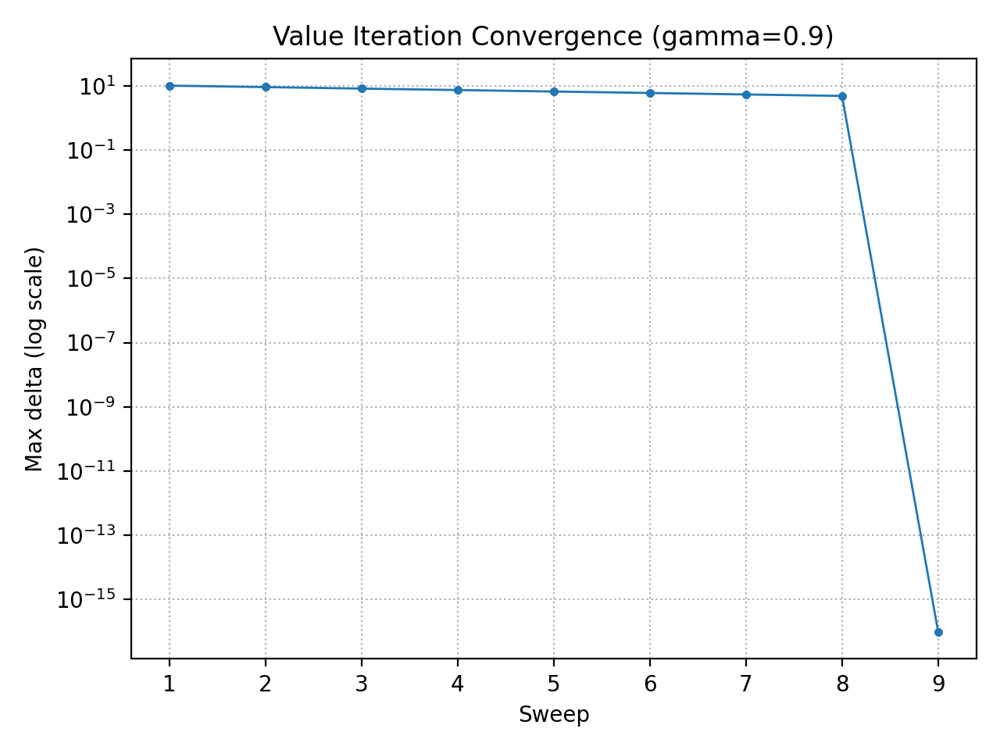

# Problem 4 – Off-policy Monte Carlo with Importance Sampling (5×5 Gridworld)

This report implements **off-policy Monte Carlo control with importance sampling** on the same 5×5 gridworld used in Problem 3, and compares the learned value estimates against **Value Iteration**.

---

## Environment (same as Problem 3)

### States
- Grid positions $(s_t = (r,c))$ where $(r,c) \in \{0,1,2,3,4\}^2$.

### Actions
- $(A = \{\text{right},\ \text{down},\ \text{left},\ \text{up}\})$.

### Transitions
- Deterministic.
- If an action would leave the grid, the agent stays in the same cell.
- The goal $(s_{4,4})$ is terminal/absorbing.

### Rewards (state-based)
- $(R(s)=+10)$ if $(s=s_{4,4})$
- $(R(s)=-5)$ if $(s \in S_{grey})$ where $(S_{grey}=\{s_{2,2}, s_{3,0}, s_{0,4}\})$
- $(R(s)=-1)$ otherwise

### Discount factor
- $(\gamma = 0.9)$.

---

## Episodic reward timing

Both Monte Carlo and Value Iteration use the same episodic semantics:

- Reward on arrival: $(R_{t+1} = R(S_{t+1}))$
- Terminal continuation value: $(V(s_{4,4})=0)$ because the episode ends when the agent enters the goal

---

## Off-policy Monte Carlo with Weighted Importance Sampling

### Policies
- Behavior policy $(b(a\mid s))$: uniform random, so $(b(a\mid s)=0.25)$ for all actions.
- Target policy $(\pi(a\mid s))$: deterministic greedy w.r.t. $(Q(s,a))$.

### Return
- $(G_t = \sum_{k=0}^{T-t-1} \gamma^k R_{t+k+1})$

### Weighted importance sampling update (control)

Maintain $(Q(s,a))$ and a cumulative weight table $(C(s,a))$. Process each episode backward:

- $G \leftarrow \gamma G + R_{t+1}$
- $C(S_t, A_t) \leftarrow C(S_t, A_t) + W$
- $Q(S_t, A_t) \leftarrow Q(S_t, A_t) + \frac{W}{C(S_t, A_t)}\big(G - Q(S_t, A_t)\big)$
- Improve target policy: $(\pi(S_t) \leftarrow \arg\max_a Q(S_t,a))$
- Update weight: $W \leftarrow \frac{W}{b(A_t\mid S_t)}$

Because $(\pi)$ is deterministic greedy, if the behavior action differs from the greedy action at some step, the importance ratio for earlier steps becomes 0. The implementation stops the backward loop early (standard optimization).

---

## Value Iteration baseline

Episodic Bellman backup:
- For a transition to $s'$ under action $a$:
  - if $(s' = s_{4,4})$, then $(q(s,a)=R(s'))$
  - else $(q(s,a)=R(s') + \gamma V(s'))$
- $(V(s) = \max_a q(s,a))$

---

## Results

### Monte Carlo estimate: $V_{MC}(s)=\max_a Q(s,a)$

| r\c | 0 | 1 | 2 | 3 | 4 |
|---:|---:|---:|---:|---:|---:|
| **0** | -0.44 | 0.62 | 1.79 | 3.10 | 4.55* |
| **1** | 0.62 | 1.80 | 3.10 | 4.56 | 6.18 |
| **2** | 1.78 | 3.09 | 4.57* | 6.18 | 7.99 |
| **3** | 3.10* | 4.56 | 6.18 | 7.99 | 10.00 |
| **4** | 4.55 | 6.18 | 7.99 | 10.00 | 0.00G |

Legend: `G` = goal (terminal), `*` = grey state.

### Greedy target policy from Monte Carlo

| r\c | 0 | 1 | 2 | 3 | 4 |
|---:|:---:|:---:|:---:|:---:|:---:|
| **0** | → | ↓ | → | ↓ | ↓ |
| **1** | → | → | → | → | ↓ |
| **2** | → | ↓ | → | ↓ | ↓ |
| **3** | → | → | → | → | ↓ |
| **4** | → | → | → | → | G |

### Value Iteration solution: $V^*(s)$

| r\c | 0 | 1 | 2 | 3 | 4 |
|---:|---:|---:|---:|---:|---:|
| **0** | -0.43 | 0.63 | 1.81 | 3.12 | 4.58* |
| **1** | 0.63 | 1.81 | 3.12 | 4.58 | 6.20 |
| **2** | 1.81 | 3.12 | 4.58* | 6.20 | 8.00 |
| **3** | 3.12* | 4.58 | 6.20 | 8.00 | 10.00 |
| **4** | 4.58 | 6.20 | 8.00 | 10.00 | 0.00G |

Legend: `G` = goal (terminal), `*` = grey state.

### Greedy policy from Value Iteration

| r\c | 0 | 1 | 2 | 3 | 4 |
|---:|:---:|:---:|:---:|:---:|:---:|
| **0** | → | → | → | ↓ | ↓ |
| **1** | → | → | → | → | ↓ |
| **2** | → | ↓ | → | → | ↓ |
| **3** | → | → | → | → | ↓ |
| **4** | → | → | → | → | G |

### Final numerical agreement (MC vs VI)
- $(\max_s |V_{MC}(s) - V^*(s)| = 0.0346)$
- Mean absolute error: 0.0161
- RMSE: 0.0188

---

## Convergence logs and plots

The script produces:
- `mc_convergence_log.csv`: error of MC vs $V^*$ every evaluation interval
- `vi_convergence_log.csv`: VI max-delta per sweep
- `vi_convergence.png`: Value Iteration max-delta vs sweeps
- `mc_convergence.png`: MC error vs episodes

---


Checkpoint snapshot from `mc_convergence_log.csv`:

| Episode | MC max $|V-V^*|$ | MC RMSE |
|---:|---:|---:|
| 1 | 10.0000 | 4.6322 |
| 15000 | 0.0532 | 0.0211 |
| 30000 | 0.0346 | 0.0188 |

---

## Comparison discussion

### Optimization time
- Value Iteration converges in a small number of sweeps because it performs exact Bellman backups over all states.
- Off-policy Monte Carlo requires many sampled episodes because it is model-free and relies on noisy return estimates.

### Sample efficiency and variance
- The behavior policy is uniform random, so many trajectories do not match the greedy target policy for long.
- Importance sampling corrects the distribution mismatch, but can introduce high variance.
- Weighted importance sampling reduces variance relative to ordinary IS, but convergence is still slower than dynamic programming for a small known model.

### Computational complexity (high level)
Let $(|S|=25)$ and $(|A|=4)$.

- Value Iteration:
  - Per sweep: $(O(|S||A|))$
  - Memory: $(O(|S|))$
- Off-policy MC control:
  - Per episode: $(O(T))$ where $T$ is episode length
  - Total: $(O(N_{episodes} \cdot T))$
  - Memory: $(O(|S||A|))$ for storing $(Q)$ and $(C)$

---

## Conclusion

- Value Iteration is most efficient here because the model is known and the state space is tiny.
- Off-policy Monte Carlo with weighted importance sampling estimates values close to $V^*$, but needs many episodes due to sampling noise and importance sampling variance.
  
## Full code

```
import csv
import time
import numpy as np
import matplotlib.pyplot as plt


# -----------------------------
# 5x5 Gridworld (Problem 3)
# -----------------------------

N = 5
GAMMA = 0.9
MAX_STEPS_PER_EPISODE = 200

ACTIONS = ["right", "down", "left", "up"]
ACTION_TO_DELTA = {
    "right": (0, 1),
    "down": (1, 0),
    "left": (0, -1),
    "up": (-1, 0),
}
ACTION_INDEX = {a: i for i, a in enumerate(ACTIONS)}

GOAL = (4, 4)
GREY_STATES = {(2, 2), (3, 0), (0, 4)}

R_GOAL = 10
R_GREY = -5
R_REG = -1


def build_reward_grid():
    R = np.full((N, N), R_REG, dtype=float)
    for s in GREY_STATES:
        R[s] = R_GREY
    R[GOAL] = R_GOAL
    return R


R = build_reward_grid()


def is_valid(r, c):
    return 0 <= r < N and 0 <= c < N


def next_state(s, a):
    """Deterministic transition with wall-bounce. Goal is absorbing for transitions."""
    if s == GOAL:
        return GOAL
    r, c = s
    dr, dc = ACTION_TO_DELTA[a]
    nr, nc = r + dr, c + dc
    if is_valid(nr, nc):
        return (nr, nc)
    return (r, c)


def reward_of_state(s):
    """State-based reward R(s)."""
    return float(R[s])


def sample_start_state(rng: np.random.Generator):
    """Exploring starts: choose any non-terminal state with probability > 0."""
    while True:
        r = int(rng.integers(0, N))
        c = int(rng.integers(0, N))
        if (r, c) != GOAL:
            return (r, c)


# -----------------------------
# Policies
# -----------------------------

def behavior_policy_prob(_s, _a):
    """Uniform random behavior policy b(a|s)=1/4."""
    return 1.0 / len(ACTIONS)


def behavior_policy_sample(rng: np.random.Generator):
    return ACTIONS[int(rng.integers(0, len(ACTIONS)))]


def greedy_action_from_Q(Q, s):
    r, c = s
    a_idx = int(np.argmax(Q[r, c, :]))
    return ACTIONS[a_idx]


# -----------------------------
# Episode generation
# -----------------------------

def generate_episode(rng):
    """
    Generate an episode using behavior policy b.
    Store tuples: (s_t, a_t, r_{t+1})
    Reward is on arrival: r_{t+1} = R(s_{t+1})
    """
    episode = []
    s = sample_start_state(rng)

    for _ in range(MAX_STEPS_PER_EPISODE):
        a = behavior_policy_sample(rng)
        s2 = next_state(s, a)

        # reward upon entering s2
        r = reward_of_state(s2)

        episode.append((s, a, r))
        s = s2

        if s == GOAL:
            break

    return episode


# -----------------------------
# Value Iteration (episodic, with optional logging)
# -----------------------------

def value_iteration(theta=1e-10, max_sweeps=100000, log_csv_path=None):
    """
    Episodic VI matching MC reward timing:
    - Reward on arrival: r = R(s')
    - If s' is GOAL: val = R(GOAL) (no gamma*V[GOAL])
    - Terminal continuation value: V(GOAL)=0
    """
    V = np.zeros((N, N), dtype=float)
    sweeps = 0

    log_f = None
    writer = None
    if log_csv_path:
        log_f = open(log_csv_path, "w", newline="", encoding="utf-8")
        writer = csv.writer(log_f)
        writer.writerow(["sweep", "max_delta"])

    t0 = time.perf_counter()
    try:
        while sweeps < max_sweeps:
            sweeps += 1
            delta = 0.0
            V_new = V.copy()

            for r in range(N):
                for c in range(N):
                    s = (r, c)

                    if s == GOAL:
                        V_new[s] = 0.0
                        delta = max(delta, abs(V_new[s] - V[s]))
                        continue

                    best_val = -np.inf
                    for a in ACTIONS:
                        s2 = next_state(s, a)
                        r2 = reward_of_state(s2)

                        if s2 == GOAL:
                            val = r2
                        else:
                            val = r2 + GAMMA * V[s2]

                        if val > best_val:
                            best_val = val

                    V_new[s] = best_val
                    delta = max(delta, abs(V_new[s] - V[s]))

            V = V_new

            if writer:
                writer.writerow([sweeps, delta])

            if delta < theta:
                break
    finally:
        if log_f:
            log_f.close()

    t1 = time.perf_counter()

    # Greedy policy from V
    pi = np.empty((N, N), dtype=object)
    for r in range(N):
        for c in range(N):
            s = (r, c)
            if s == GOAL:
                pi[r, c] = "G"
                continue

            best_a, best_val = None, -np.inf
            for a in ACTIONS:
                s2 = next_state(s, a)
                r2 = reward_of_state(s2)
                if s2 == GOAL:
                    val = r2
                else:
                    val = r2 + GAMMA * V[s2]
                if val > best_val:
                    best_val = val
                    best_a = a

            pi[r, c] = best_a

    stats = {"sweeps": sweeps, "time_sec": (t1 - t0)}
    return V, pi, stats


# -----------------------------
# Off-policy MC Control (Weighted IS) + logging
# -----------------------------

def q_to_v(Q):
    """Convert Q(s,a) to V(s)=max_a Q(s,a), with terminal continuation value V(goal)=0."""
    V = np.max(Q, axis=2)
    V[GOAL] = 0.0
    return V


def off_policy_mc_control_with_logging(
    V_vi,
    num_episodes=30000,
    seed=0,
    eval_interval=500,
    log_csv_path="mc_convergence_log.csv",
):
    """
    Logs MC convergence by comparing V_MC to V_VI every eval_interval episodes.
    CSV columns:
      episode, elapsed_sec, max_abs_diff, mean_abs_diff, rmse
    """
    rng = np.random.default_rng(seed)
    Q = np.zeros((N, N, len(ACTIONS)), dtype=float)
    C = np.zeros((N, N, len(ACTIONS)), dtype=float)

    log_f = open(log_csv_path, "w", newline="", encoding="utf-8")
    writer = csv.writer(log_f)
    writer.writerow(["episode", "elapsed_sec", "max_abs_diff", "mean_abs_diff", "rmse"])

    t0 = time.perf_counter()
    try:
        for ep in range(1, num_episodes + 1):
            episode = generate_episode(rng)

            G = 0.0
            W = 1.0

            for (s, a, r) in reversed(episode):
                G = GAMMA * G + r

                rs, cs = s
                ai = ACTION_INDEX[a]

                C[rs, cs, ai] += W
                Q[rs, cs, ai] += (W / C[rs, cs, ai]) * (G - Q[rs, cs, ai])

                greedy_a = greedy_action_from_Q(Q, s)
                if a != greedy_a:
                    break

                W = W / behavior_policy_prob(s, a)

            if (ep % eval_interval) == 0 or ep == 1:
                elapsed = time.perf_counter() - t0
                V_mc = q_to_v(Q)

                diff = V_mc - V_vi
                max_abs = float(np.max(np.abs(diff)))
                mean_abs = float(np.mean(np.abs(diff)))
                rmse = float(np.sqrt(np.mean(diff * diff)))

                writer.writerow([ep, elapsed, max_abs, mean_abs, rmse])

    finally:
        log_f.close()

    # Extract final greedy policy and V
    pi = np.empty((N, N), dtype=object)
    V = q_to_v(Q)

    for r in range(N):
        for c in range(N):
            s = (r, c)
            if s == GOAL:
                pi[r, c] = "G"
            else:
                pi[r, c] = greedy_action_from_Q(Q, s)

    stats = {"episodes": num_episodes, "time_sec": (time.perf_counter() - t0)}
    return Q, pi, V, stats


# -----------------------------
# Plotting utilities
# -----------------------------

def read_mc_log(path):
    episodes, max_abs, mean_abs, rmse = [], [], [], []
    with open(path, "r", encoding="utf-8") as f:
        reader = csv.DictReader(f)
        for row in reader:
            episodes.append(int(row["episode"]))
            max_abs.append(float(row["max_abs_diff"]))
            mean_abs.append(float(row["mean_abs_diff"]))
            rmse.append(float(row["rmse"]))
    return np.array(episodes), np.array(max_abs), np.array(mean_abs), np.array(rmse)


def read_vi_log(path):
    sweeps, deltas = [], []
    with open(path, "r", encoding="utf-8") as f:
        reader = csv.DictReader(f)
        for row in reader:
            sweeps.append(int(row["sweep"]))
            deltas.append(float(row["max_delta"]))
    return np.array(sweeps), np.array(deltas)


# --- EXACT PATCH: replace your plot_convergence(...) with this version ---
# It generates TWO separate figures:
#   1) vi_convergence.png  (VI max-delta vs sweeps)
#   2) mc_convergence.png  (MC errors vs episodes)
# and opens both windows (plt.show()).

def plot_convergence_two_figures(
    mc_log_path,
    vi_log_path,
    vi_save_path="vi_convergence.png",
    mc_save_path="mc_convergence.png",
):
    ep, mc_max, mc_mean, mc_rmse = read_mc_log(mc_log_path)
    sw, vi_delta = read_vi_log(vi_log_path)

    # ---------- Figure 1: Value Iteration ----------
    plt.figure()
    plt.semilogy(sw, np.clip(vi_delta, 1e-16, None), marker="o", markersize=3, linewidth=1)
    plt.xlabel("Sweep")
    plt.ylabel("Max delta (log scale)")
    plt.title(f"Value Iteration Convergence (gamma={GAMMA})")
    plt.grid(True, which="both", linestyle=":")
    plt.tight_layout()
    plt.savefig(vi_save_path, dpi=200)

    # ---------- Figure 2: Monte Carlo ----------
    plt.figure()
    plt.semilogy(ep, np.clip(mc_max, 1e-16, None), marker="o", markersize=3, linewidth=1, label="MC max |V - V*|")
    plt.semilogy(ep, np.clip(mc_rmse, 1e-16, None), marker="o", markersize=3, linewidth=1, label="MC RMSE(V, V*)")
    # If you want mean-abs too, uncomment:
    # plt.semilogy(ep, np.clip(mc_mean, 1e-16, None), marker="o", markersize=3, linewidth=1, label="MC mean |V - V*|")

    plt.xlabel("Episode")
    plt.ylabel("Error metric (log scale)")
    plt.title(f"Off-policy MC Convergence (gamma={GAMMA})")
    plt.grid(True, which="both", linestyle=":")
    plt.legend()
    plt.tight_layout()
    plt.savefig(mc_save_path, dpi=200)

    plt.show()


# -----------------------------
# Pretty printing
# -----------------------------

def action_to_arrow(a):
    return {"right": "→", "down": "↓", "left": "←", "up": "↑", "G": "G"}.get(a, "?")


def print_value_table(V, title):
    print("\n" + title)
    for r in range(N):
        row = []
        for c in range(N):
            s = (r, c)
            cell = f"{V[r,c]:7.2f}"
            if s == GOAL:
                cell += "G"
            elif s in GREY_STATES:
                cell += "*"
            row.append(cell)
        print(" ".join(row))
    print("\nLegend: G = goal, * = grey state")


def print_policy_table(pi, title):
    print("\n" + title)
    for r in range(N):
        row = []
        for c in range(N):
            row.append(f"  {action_to_arrow(pi[r,c])}  ")
        print("".join(row))


# -----------------------------
# Main
# -----------------------------

def main():
    NUM_EPISODES = 30000
    SEED = 1
    EVAL_INTERVAL = 500

    mc_log = "logs/mc_convergence_log.csv"
    vi_log = "logs/vi_convergence_log.csv"

    print("=== Compute Value Iteration baseline (V*) ===")
    V_vi, pi_vi, stats_vi = value_iteration(theta=1e-10, log_csv_path=vi_log)
    print(f"VI runtime: {stats_vi['time_sec']:.6f} sec, sweeps={stats_vi['sweeps']}")
    print_value_table(V_vi, "V*(s) from Value Iteration (episodic)")
    print_policy_table(pi_vi, "Greedy policy from Value Iteration")

    print("\n=== Off-policy MC Control with Weighted IS (logging enabled) ===")
    print(f"gamma={GAMMA}, episodes={NUM_EPISODES}, eval_interval={EVAL_INTERVAL}")
    Q_mc, pi_mc, V_mc, stats_mc = off_policy_mc_control_with_logging(
        V_vi,
        num_episodes=NUM_EPISODES,
        seed=SEED,
        eval_interval=EVAL_INTERVAL,
        log_csv_path=mc_log,
    )

    print(f"\nMC runtime: {stats_mc['time_sec']:.4f} sec for {stats_mc['episodes']} episodes")
    print_value_table(V_mc, "Estimated V(s) from Off-policy MC (V(s)=max_a Q(s,a))")
    print_policy_table(pi_mc, "Greedy policy from MC")

    diff = np.max(np.abs(V_mc - V_vi))
    print("\n=== Final comparison (MC vs VI) ===")
    print(f"Max |V_MC - V_VI| = {diff:.4f}")
    print(f"Logs written: {mc_log}, {vi_log}")

    vi_plot_path = "images/vi_convergence.png"
    mc_plot_path = "images/mc_convergence.png"
    plot_convergence_two_figures(mc_log, vi_log, vi_save_path=vi_plot_path, mc_save_path=mc_plot_path)

    print(f"VI plot saved as: {vi_plot_path}")
    print(f"MC plot saved as: {mc_plot_path}")


if __name__ == "__main__":
    main()

```

